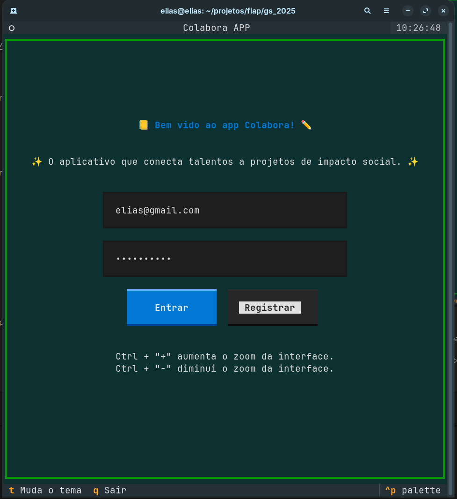
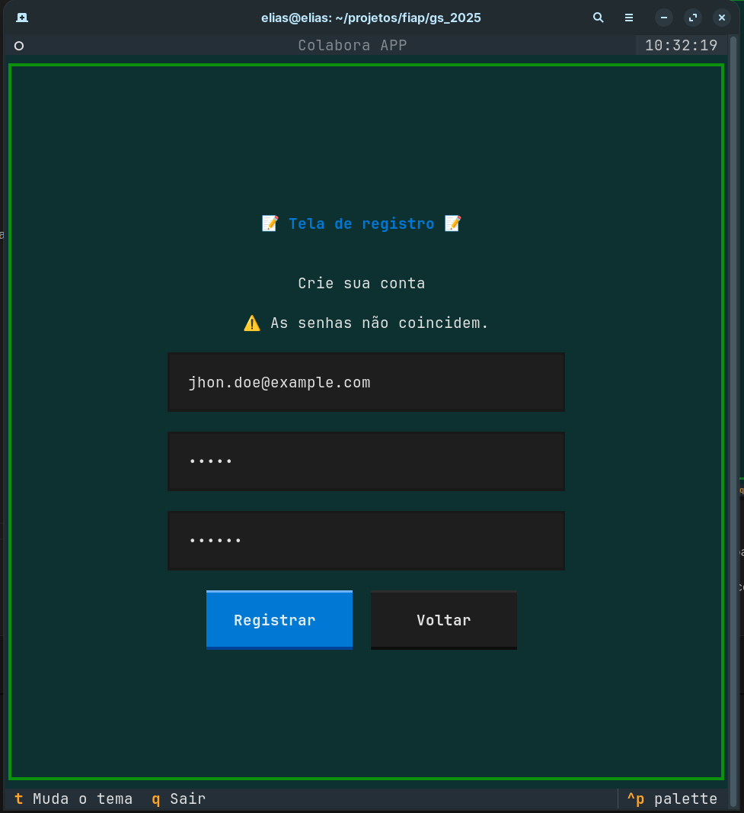
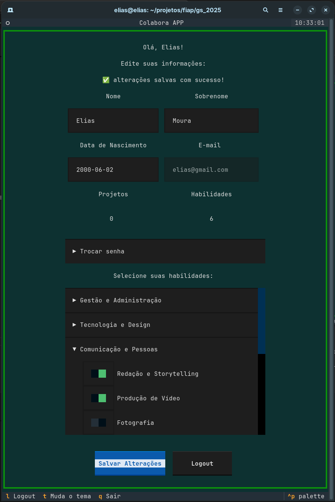
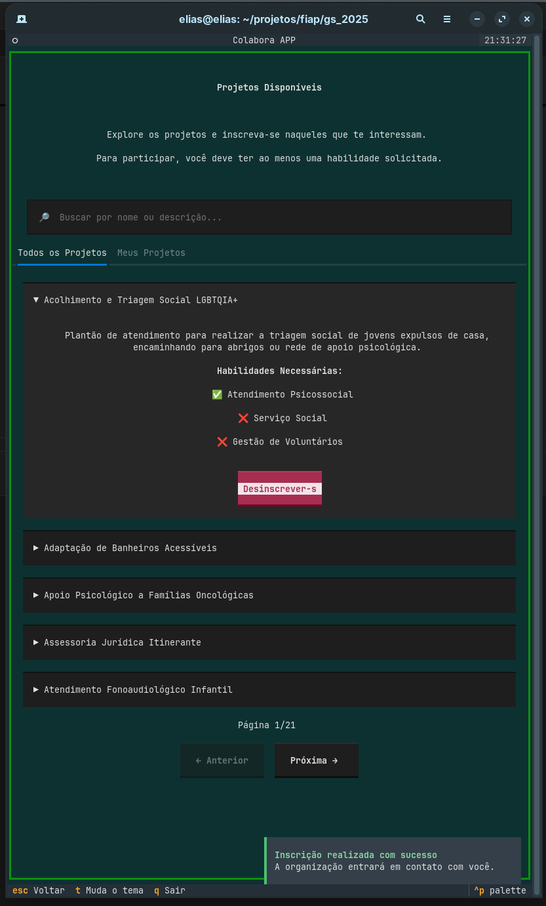

# Colabora APP

✨ O aplicativo que conecta talentos a projetos de impacto social. ✨

Colabora é uma aplicação de interface de texto (TUI) construída com [Textual](https://textual.textualize.io/) que permite a voluntários encontrar projetos e a ONGs encontrarem as habilidades de que precisam.

<p align="center">
  
  
</p>

<p align="center">
  
  
</p>

---

# 📚 Documentação

A documentação completa do projeto está organizada na pasta `docs/`.

### 🔍 Arquitetura e Domínio (`docs/architecture/`)
- **Modelos de Dados** → [`data-model.md`](docs/architecture/data-model.md)
- **Casos de Uso (Features)** → [`features.md`](docs/architecture/features.md)
- **Segurança & Hash de Senhas** → [`security.md`](docs/architecture/security.md)

### 🖥️ Interface TUI (`docs/cli/`)
- **Tela de Login** → [`login.md`](docs/cli/login.md)
- **Tela de Registro** → [`register.md`](docs/cli/register.md)
- **Tela de Projetos** → [`projects.md`](docs/cli/projects.md)
- **Tela do Usuário / Perfil** → [`user-screen.md`](docs/cli/user-screen.md)
- **Painel Administrativo** → [`admin.md`](docs/cli/admin.md)

---

# 🚀 Começando

Siga estas instruções para obter uma cópia do projeto em sua máquina local para desenvolvimento e testes.

## Pré-requisitos

Antes de começar, certifique-se de ter o seguinte instalado:

- **Python 3.11+**
- **Poetry**: Ferramenta para gerenciamento de dependências.  
  Instalação oficial: https://python-poetry.org/docs/#installation

---

# 📦 Instalação (via Poetry)

1. **Clone o repositório:**

```bash
git clone https://github.com/trabalhos-si-fiap/colabora-app
cd colabora-app
```

2. **Instale as dependências:**

```bash
poetry install
```

---

# 📦 Instalação Alternativa (via pip)

Se preferir não usar Poetry:

```bash
python -m venv .venv
.venv\Scripts\activate

pip install -r requirements.txt
```

### Executar a aplicação:

```bash
python main.py
```

### Executar os testes:

```bash
pytest
```

---

# 🏃‍♀️ Executando a Aplicação (via Poetry)

Este projeto usa Taskipy para gerenciar tarefas. Para iniciar a TUI:

```bash
poetry run task start
```

Isso iniciará a tela de login, onde você pode entrar com uma conta existente ou se registrar.

---

# ✅ Executando os Testes

```bash
poetry run task test
```

Para verificar a cobertura dos testes:

```bash
poetry run task coverage
```

---

# 🎨 Estilo de Código e Linting

Formatadores e linters utilizados:

- `black`
- `isort`
- `flake8`

Execute:

```bash
poetry run task lint
```

---

# 🤝 Como Contribuir

Estamos abertos a contribuições! Para colaborar:

1. Faça um **Fork**.
2. Crie uma branch:  
   `git checkout -b feature/nova-feature`
3. Faça commits:  
   `git commit -m "Adiciona nova feature"`
4. Faça o push:  
   `git push origin feature/nova-feature`
5. Abra um **Pull Request**.

Obrigado por ajudar a tornar o Colabora ainda melhor! ❤️
